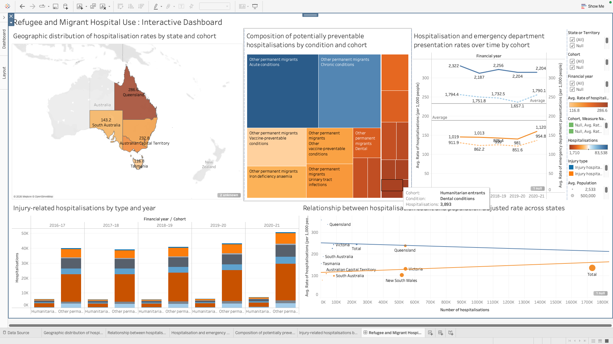
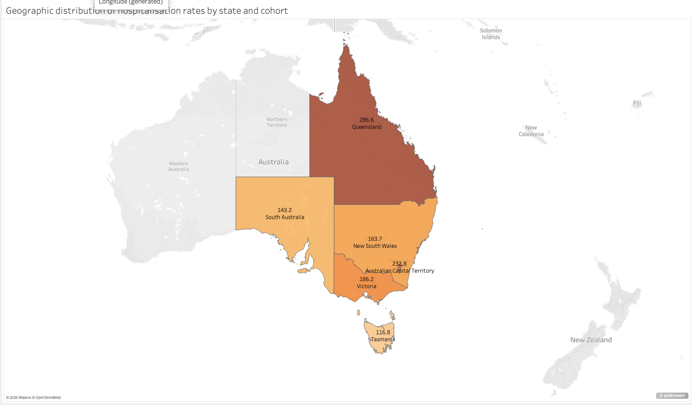
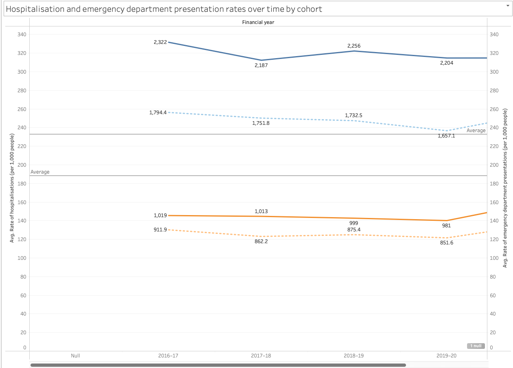
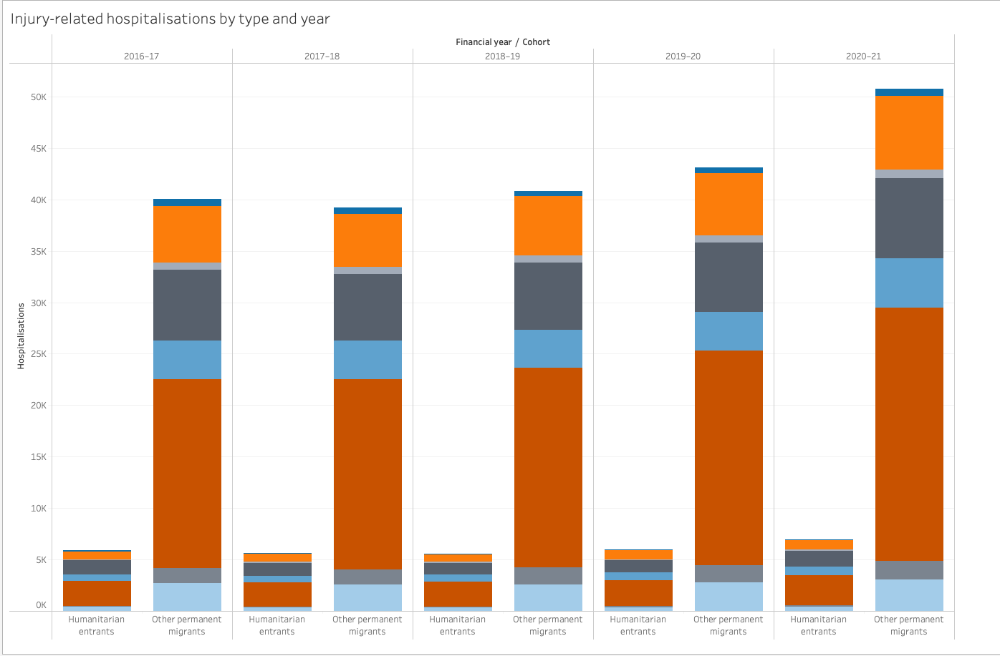
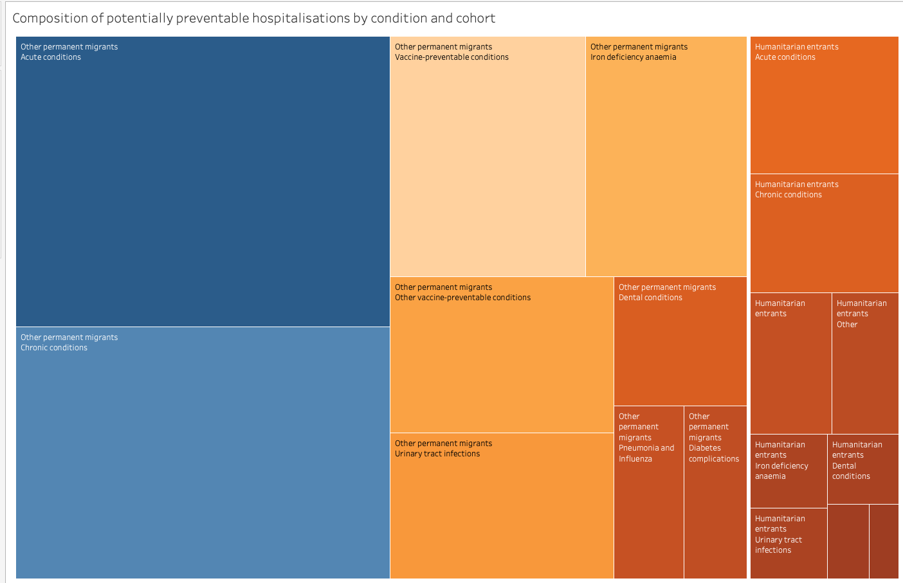

# Hospital Utilisation Tableau Dashboard

An interactive Tableau dashboard analysing hospital utilisation and health outcomes across Australian regions and demographic groups.

## Dashboard Preview

## Key Visualisations

### Geographic Distribution

### Hospitalisation Rates Over Time

### Stacked Bar Chart

### Preventable Hospitalisations Treemap

## Tableau Workbook

The packaged Tableau workbook is included in this repository:

`Interactive Dashboard.twbx`

## Project Overview

This project was developed to explore patterns in hospital utilisation and health outcomes using interactive data visualisation.

The dashboard allows users to compare hospitalisation patterns across geographic regions, time periods and population groups, while using multiple visualisations to communicate trends and differences clearly.

## Key Insights

- Hospitalisation patterns vary considerably across Australian regions and demographic groups.
- Population-adjusted rates provide more meaningful comparisons than raw hospitalisation counts alone.
- Time-series analysis highlights changes in hospital utilisation across financial years.
- Geographic and categorical visualisations help identify areas and population groups with higher levels of preventable hospitalisations.

## Tools Used

- Tableau
- Data visualisation
- Dashboard design
- Data cleaning and preparation
- Interactive filters and dashboard actions
